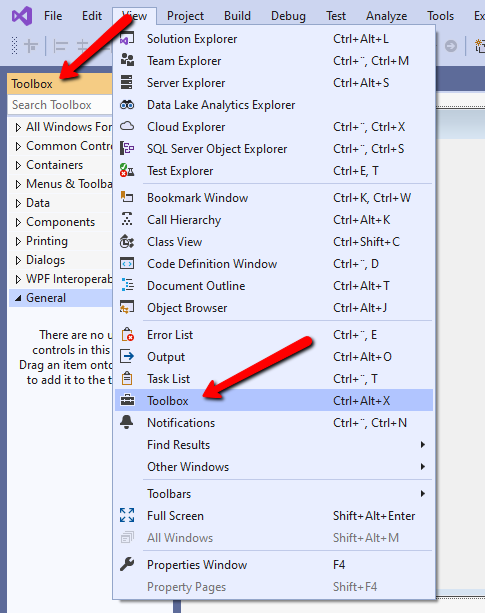
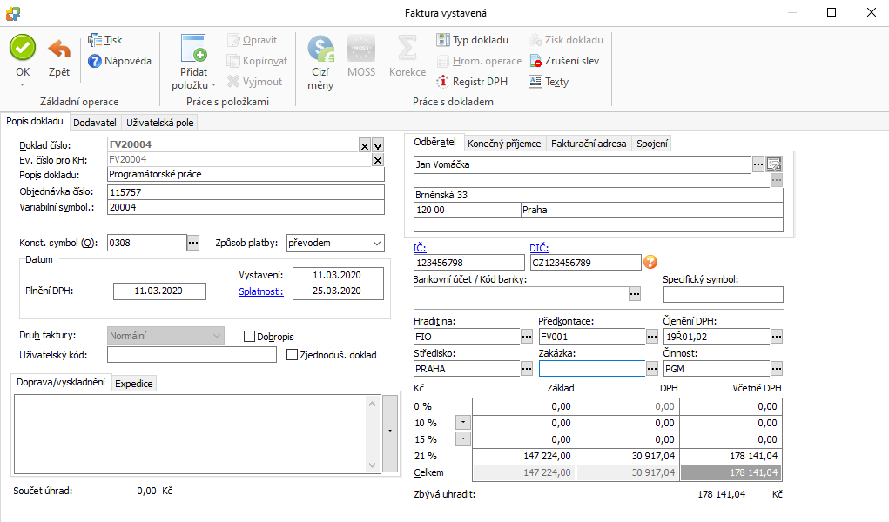
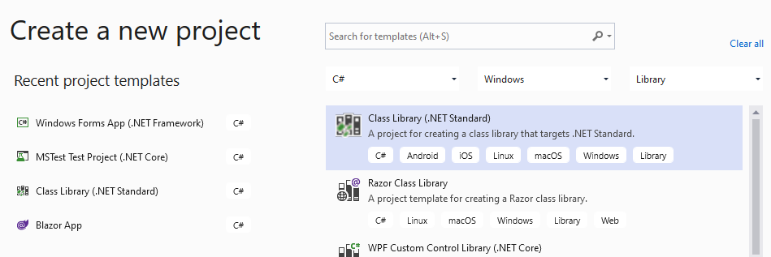
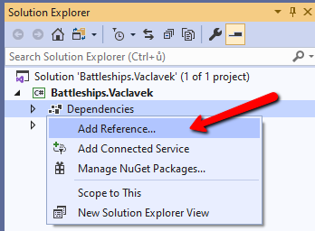
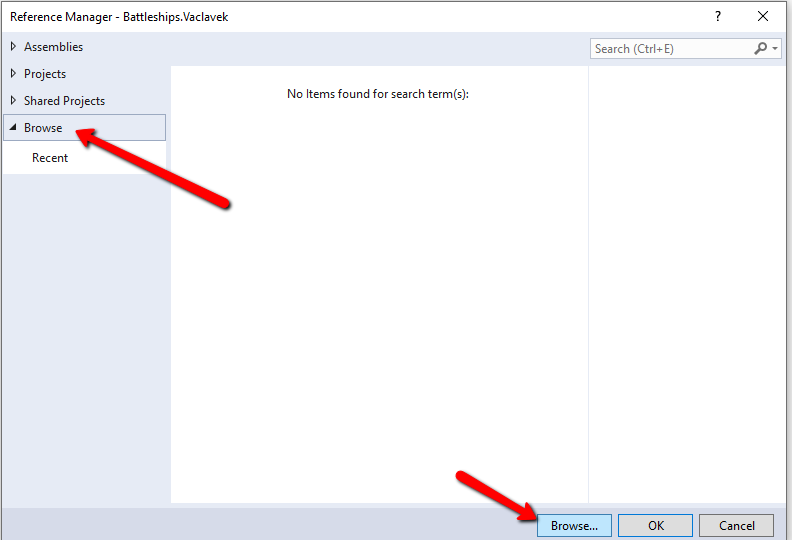
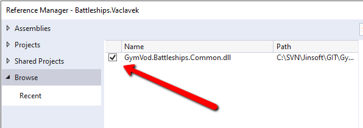
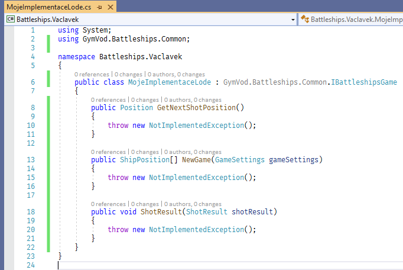

# Domácí práce 12. 3. 2020
Tento týden vám k práci zadávám následující dva úkoly:

## Použití controlů

1. Založte nový projekt "Windows forms aplikace" 

2. Zobrazte si toolbox

3. Pokuste se z vizuálně *hezky* vytvořit "editor faktury" (samozřejmě bez jakékoli funkčnosti). Měli byste použít následující controly:
- Button - uložení formuláře
- CheckBox - volba zjednodušený daňový doklad (ano/ne)
- ComboBox - výběr země odběratele (vložte alespoň 3 země)
- DateTimePicker - datum vystavení a splatnosti
- Label - popisky
- LinkLabel - IČ (kliknutím na odkaz by se mohly například načíst údaje z FÚ)
- MaskedTextBox - telefon odběratele
- NumericUpDown - číslo faktury
- PictureBox - logo (vložte libovolné logo)
- RadioButton + GroupBox - odběratel je muž/žena
- RichTextBox - poznámka k faktuře
- TextBox - pole pro zadání odběratele
- Panel - oddělení položek, které k sobě logicky náleží
- MenuStrip - základní menu (alespoň 3 položky na hlavní úrovni, 2 na rozbalovací úrovni)
- StatusStrip - stav formuláře
- SaveFileDialog - uložení faktury

4. Pro rámcovou představu (nemusíte se jí vůbec držet, jen pro představu!) přikládám, jak má zadání faktury připraven účetní software MoneyS3: 

5. Prozkoumejte hlavní vlastnosti, které jednotlivé controly mají.

6. Udělejte printescreen a pošlete mi ho mailem na adresu vaclavek@jinsoft.cz. Do předmětu prosím dejte **GymVod**.

## Příprava vašich pololetních projektů Lodě

Dostal jsem dotaz, jak máte začít programovat svůj pololetní projekt. Takže druhým úkolem  bude začít ho připravovat (kdo ještě nezačal). Níže máte návod, jak začít.

[Zadání máte zde](http://lode.ondrejvaclavek.cz/), zdrojové kódy [zde](https://github.com/vaclavek/GymVod.Battleships). Měli byste založit nový projekt typu "Class library"

Dále přidejte do svého projektu referenci na knihovnu, kterou stáhnete [zde](http://lode.ondrejvaclavek.cz/Download/GymVod.Battleships.Common.zip) (samozřejmě musíte zip rozbalit).

Dále zvolte připravenou knihovnu:

Objeví se v seznamu:

Přidejte vlastní třídu, ve které implementujete obecné rozhraní:

Dále musíte implementovat všechny tři metody, které požaduje obecné rozhraní.
Jakmile budete mít metody implementované, můžete projekt zkompilovat (vznikne dll soubor), který můžete vložit na [testovací adresu](http://lode.ondrejvaclavek.cz/), kde můžete otestovat svoji implementaci a spustit turnaj proti ostatním.

Alternativním (a lepším) způsobem, jak otestovat svoji implementaci, je stáhnout si zdrojové kódy herního enginu na výše uvedeném odkaze a použít svoji implementaci přímo v něm podobně, jako jsou tam připravení hráči Hrac1 a HracRnd. 