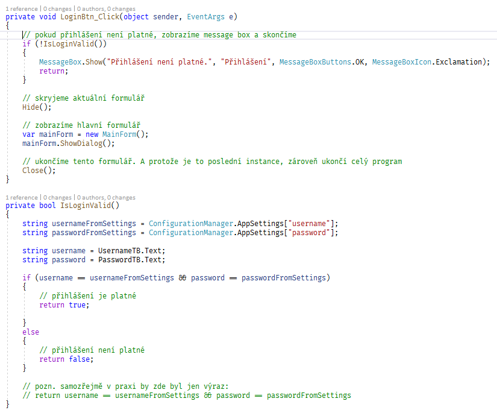
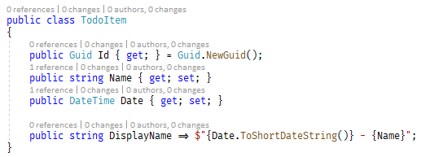
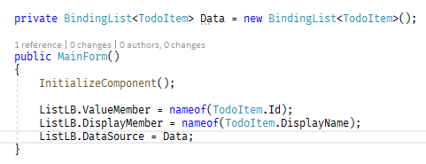
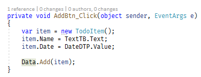
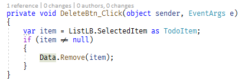

# Domácí práce 19. 3. 2020
Tento týden využijeme znalosti a zkušenosti z minulé "hodiny" a budeme se snažit zprovoznit todo list - abyste si vyzkoušeli, jak s controly pracovat. Zaměřit byste se měli na to, jak se používají vlastnosti controlů a události (kliknutí na tlačítka). 
Abyste nemuseli vše vytvářit sami od nuly, připravil jsem pro vás šablonu, kterou využijte.

## Postup práce

***Tuto úlohu byste měli zpracovávat tak, že si ji sami zkusíte vypracovat s použitím dodané šablony (ve složce template), a teprve když vám něco nebude fungovat, podíváte se níže do vzorové implementace. Své aplikace mi pošlete, nebo (ti zkušenější) mi pošlete PULL REQUEST na vložení do příslušného adresáře s domácími úkoly***

## Zadání

Aplikace bude obsahovat dva formuláře:
- **Přihlašovací formulář** - po zadání jména a hesla se zkontroluje, zda je to v pořádku. Pokud není, řekneme to uživateli. Pokud je, zobrazíme hlavní formulář.
- **Hlavní formulář aplikace** - uživateli se zobrazí textové políčko a výběr datumu. Po kliknutí na tlačítko "přidat" se položka přidá do seznamu. Po výběru položky a kliknutí na "odstranit" se položka odstraní se seznamu. Po zavření formuláře aplikace skončí.

### Ošetření přihlášení
Po kliknutí na tlačítko se vyvolá událost LoginBtn_Click. V ní je potřeba zkontrolovat, zda je přihlášení platné. Přihlašovací údaje můžete hard-codovat do kódu, nebo lépe - ložit je do souboru *app.config* a ověřit údaje proti němu.

(V tomto případě je potřeba přidat referenci na System.Configuration)

Vzorová implemntace může vypadt například takto:

### Přidání třídy TodoItem

Ve formuláři budete pracovat s třídou DataItem, což bude "model" pro každou jednotlivou položku Todo listu. 
- **Id** - generovaný GUID, který bude sloužit jako jedinečný identifikátor položky
- **Name** - název (text)
- **Date** - datum položky
- **DisplayName** - textová položka, která bude zobrazena v seznamu. Jsou zde použity *[expression-property](https://docs.microsoft.com/en-us/dotnet/csharp/programming-guide/statements-expressions-operators/expression-bodied-members#properties)* - to je ta šipka a *[interpolated string](https://docs.microsoft.com/en-us/dotnet/csharp/language-reference/tokens/interpolated)* - to je ten string s dolarem

### Nastavení seznamu

Data do seznamu dostaneme pomocí *databindingu* - propojíme property *Data* s položkami seznamu takto. 
Nastavením ValueMember říkáme, jakou property objektu TodoItem má uživateli zborazit. Nastavením DisplayMember říkáme, jakou property objektu TodoItem má nastavit jako Value.
Nastavením DataSource říkáme, jaká data se mají do ListBoxu vložit.

### Přidání položky

Přidání položky probíhá kliknutím na tlačítko *Přidat*, je v události *AddBtn_Click*.
Vytvoříme zde nový objekt **TodoItem** a nasatvíme jeho property podle zadaných dat. Tuto položku pak přidáme do seznamu *Data*.

### Odstranění položky

Odebrání položky probíhá kliknutím na tlačítko *Smazat*, je v události *DeleteBtn_Click*. Najdeme zvolenou položku - property *SelectedItem*. A pokud je něco zvoleno, odebereme ji ze seznamu.

